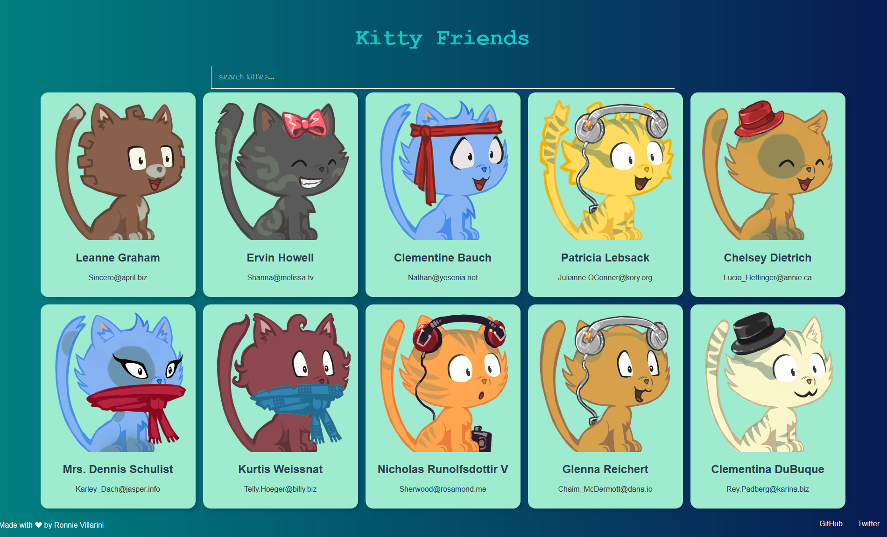

# Kitty Friends

Find your kitty friends! This is just a silly app built in Vuejs that generates cards using the
[robo hash api](https://robohash.org/) for images and the [json placeholder api](https://jsonplaceholder.typicode.com/)
for placeholder friends!

This app was originally a part of Andrei Neagoie's ['The Complete Web Developer in 2018'](https://www.udemy.com/share/100HU7A0oSd19XRXQ=/)
and was originally built in React. Since I am learning Vuejs, I decided to re-implement it 😁.

[VueJs](https://vuejs.org/)
[RoboHash](https://robohash.org/)
[JSON Placeholder](https://jsonplaceholder.typicode.com/)
